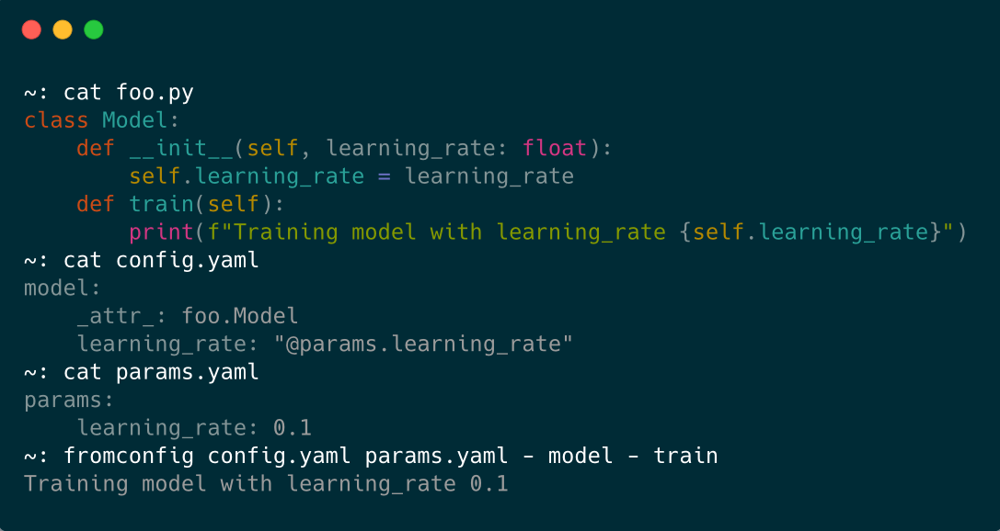

<!-- _coverpage.md -->

# FromConfig <small>0.3.0</small>

> A library to instantiate any Python object from configuration files.

- No code change
- Simple config syntax and command line
- Easily customizable

[GitHub](https://github.com/criteo/fromconfig)
[Get Started](getting-started/install)

